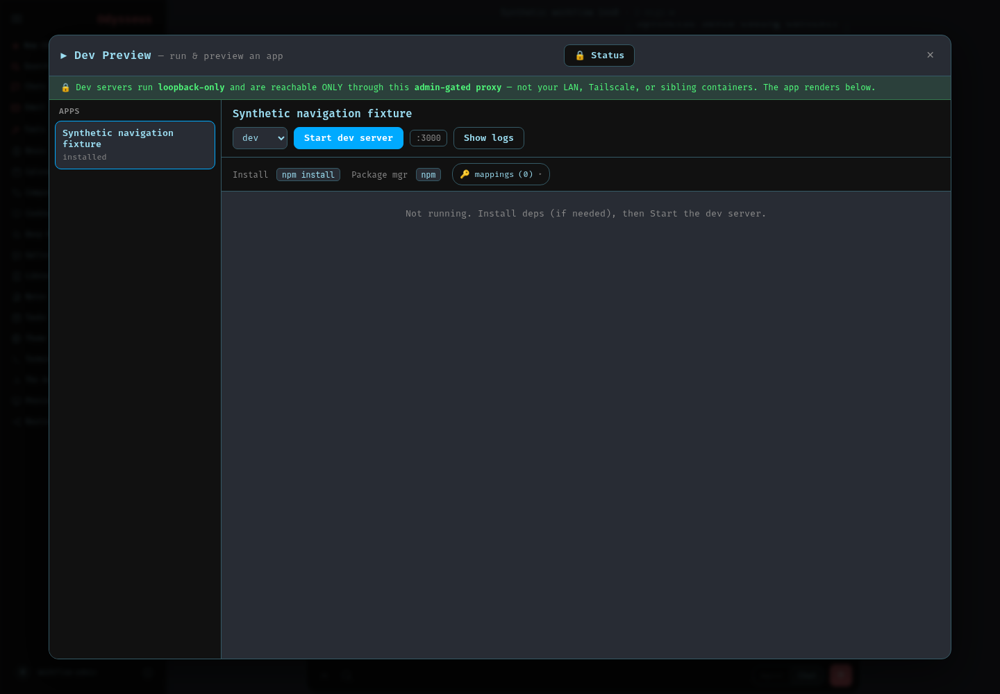
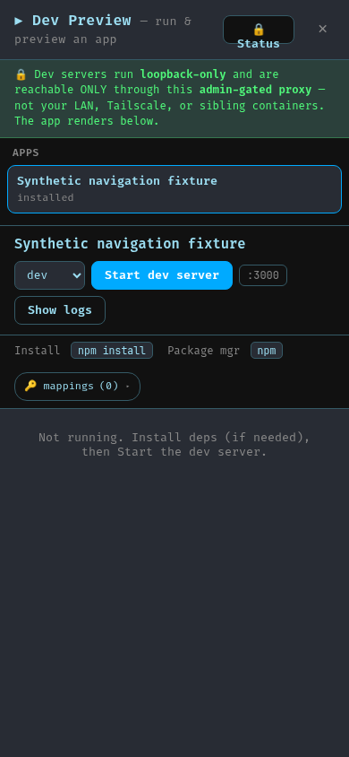

# Terminal and Preview navigation (PS-617)

Terminal and Dev Preview now use the existing shared window stack and Escape
handler. Opening either tool brings it to the front, including when it is already
open behind another window. Escape from the parent page closes only the top
eligible window through that tool's existing close button.

Escape typed into Terminal stays with the shell. Preview text fields and selects
retain their local key behavior. Covered Chat and bulk-selection controls do not
receive that Escape. Registered menus still dismiss before their window.

Closing Terminal hides it while preserving its connection and scrollback;
**Stop** disconnects it. Closing Preview stops its regular polling and clears its
iframe; stopping a dev server remains a separate explicit action. Their existing
permissions and distinct session/process ownership remain in place.

Actual running-app screenshots on synthetic private data, October 8, 2026:

Browser replay at 1440×1000 and 390×844 covered both opening orders, an ordinary
Settings window underneath, tool-input Escape, repeated opening, same-turn opens,
and explicit Terminal Stop. The current Chat session, unsent draft, Chat scroll
position and Terminal connection/scrollback survived ordinary tool navigation.
Authentication was enabled without localhost bypass; the PTY was real and
non-root. No model or provider was called, and no production account was used.

Preview qualification used a synthetic app listing; it did not install or start
an app, exercise the embedded app's own keyboard events, or certify the full
mobile coding workflow. The Terminal command check used a shell builtin; host
execution capacity was not qualified. Separate connection and in-flight polling races remain
follow-up findings. Broader PS-617 responsive shell, swipe/browser-back and UX
acceptance remain open.
