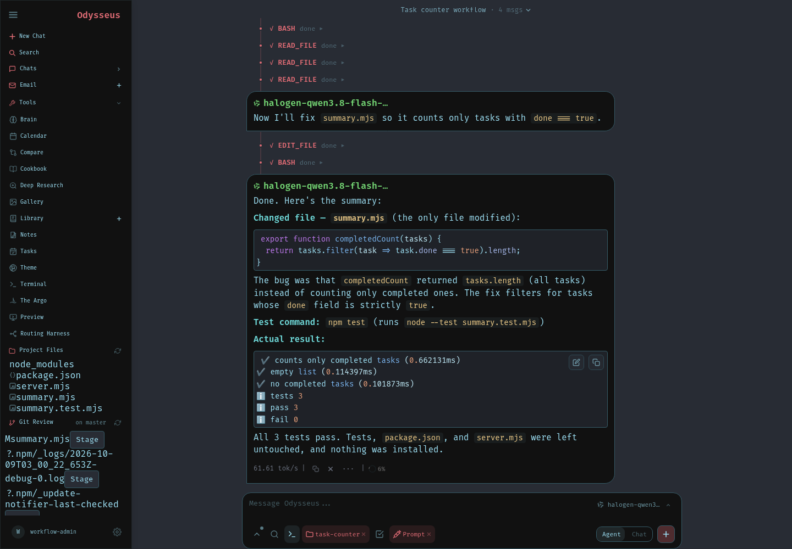
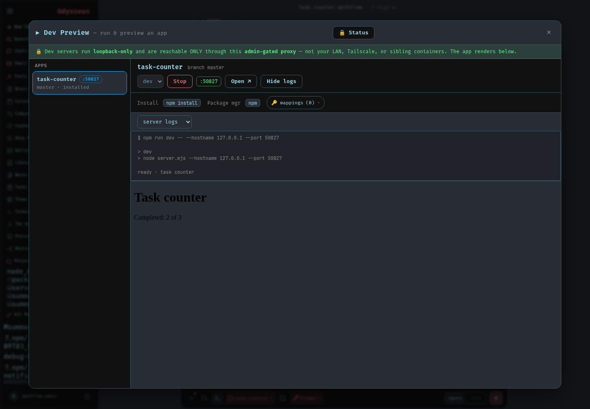
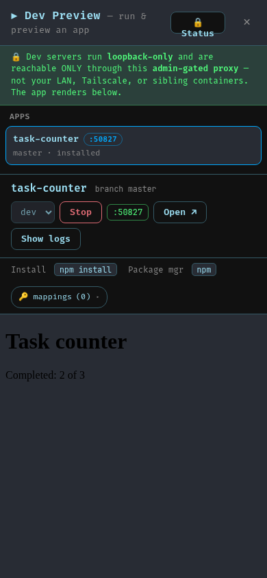

# Coding workspace continuity

A coding conversation now saves its selected project on the existing session
record. Chat, the folder picker, Project Files and Terminal use that project.
Returning to a conversation restores its folder and complete saved tool history,
including structured file-edit diffs and the final result.

Folder changes must succeed on the server before the picker reports success.
A refused change preserves the previous folder and an unsent request. A new
conversation whose folder save fails keeps its draft and retries the same
created session. Delayed saves and history responses cannot replace another
conversation's current folder or a newer confirmed choice.

Hiding Terminal preserves its shell. Changing the selected conversation or
project pauses input to the previous shell and shows the existing **Reconnect**
button. Reconnecting explicitly opens the selected project's shell. The saved
root and the turn's effective workspace remain available in owned session
history; filesystem and session authorization checks still apply.

The authenticated running-app replay used a dependency-free task-counter
fixture and a local model. It inspected and changed only `summary.mjs`, ran
`npm test` with three passing tests, and retained its result through a mid-run
reload and a later phone-sized reload. Actual embedded Preview showed
**Completed: 2 of 3** at 1440 by 1000 and 390 by 844. Terminal checks covered
the saved cwd, preserved connection, paused old-project input, explicit
reconnection to a second project, and return to the original conversation.

The successful replay allowed eight rounds and twelve tool calls, with a
512-token output setting per round and a 600-second deadline. Six-round
candidate runs completed the edit and tests but exhausted their rounds before
the final summary; their failure records are retained. This is a bounded native
Chat UX check, with no model substitution or package installation. It does not
qualify a strict 4K prompt capacity, the separate operator/Pi execution path,
server-restart continuity, or a physical mobile device.

Terminal transport, cwd and shell builtins were checked. This desktop account
already exceeds the unchanged child process ceiling, so the replay interrupted
each new shell's blocked login profile once before sending its builtin marker.
Terminal package/build execution capacity remains unqualified. Existing
Preview permissions, process ownership and separate Stop action remain in use.

This completes a bounded part of PS-617; broader responsive navigation and UX
acceptance remain open. Unsupported native function-call handling is reviewed
in a separate fix.
