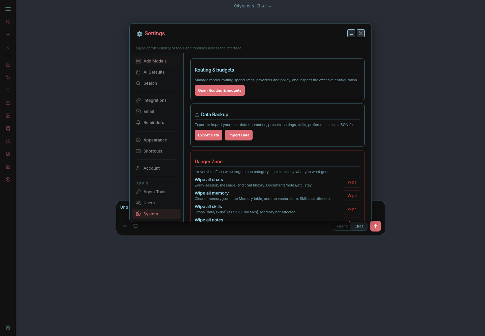
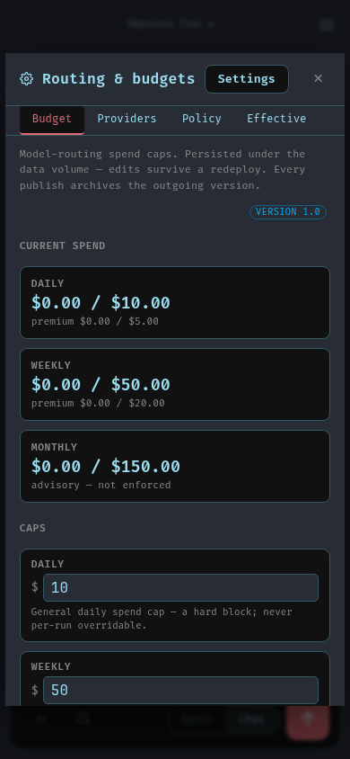

# Settings home (PS-617)

Open Settings with the sidebar or rail cog, or Ctrl+, on desktop. Administrators
can open **System > Routing & budgets** to edit Budget, Providers and Policy or
inspect Effective routing. Its **Settings** button returns to the main settings
window. Unsaved routing edits require confirmation before leaving.

The former top-level Tools entry also named Settings has moved into System.
The provider editors retain their existing behavior and permissions.

These screenshots show the running app on private synthetic data on 2026-10-08:

Desktop and mobile browser checks covered navigation, returning to Settings,
unsaved-edit cancellation and discard, minimized-window restoration, all four
routing tabs, and preservation of an unsent chat draft. Anonymous requests and
non-administrator routing access were also denied. These checks do not certify
every Settings workflow or the separate restored-user fresh-login requirement.

This is a bounded PS-617 cleanup; the broader shell and mobile UX work remains
open.
